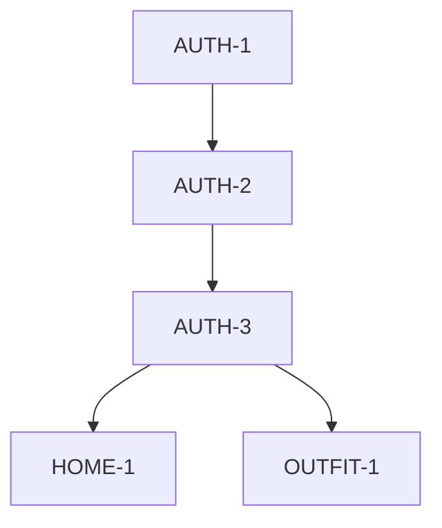

# Feature List & Status

## Legend
- ⬜ **Todo**: 작업 예정
- 🔄 **In Progress**: 작업 중
- 👀 **Need Verify**: 구현 완료, 검증 필요
- ✅ **Complete**: 완료 및 검증 끝

## Features

### 🔹 AUTH (Authentication)
사용자 인증 및 권한 관리

| ID | Detail Feature | Status | Priority | Spec |
|----|----------------|--------|----------|------|
| **AUTH-1** | 로그인 페이지 UI (Kakao, Google, Apple) | 🔄 | P1 | [Spec](../../app/login/SPEC.md) |
| **AUTH-2** | 소셜 로그인 로직 연동 (Kakao, Google) | ⬜ | P1 | - |
| **AUTH-3** | 유저 세션 동기화 (GET /me) | ⬜ | P1 | - |

### 🔹 HOME (Main Feed)
메인 피드 및 추천

| ID | Detail Feature | Status | Priority | Spec |
|----|----------------|--------|----------|------|
| **HOME-1** | 메인 배너 및 카테고리 UI | ⬜ | P2 | - |
| **HOME-2** | 상품 리스트 무한 스크롤 | ⬜ | P2 | - |

### 🔹 OUTFIT (Closet & AI)
AI 옷장 및 스타일링

| ID | Detail Feature | Status | Priority | Spec |
|----|----------------|--------|----------|------|
| **OUTFIT-1** | 옷장 목록 조회 UI | ⬜ | P1 | - |
| **OUTFIT-2** | 📱 이미지 업로드 (Camera/Gallery) | ⬜ | P2 | - |
| **OUTFIT-3** | ✨ AI 스타일 분석 요청 | ⬜ | P3 | - |

## Work Dependency Graph
작업 순서 및 의존성 파악용

