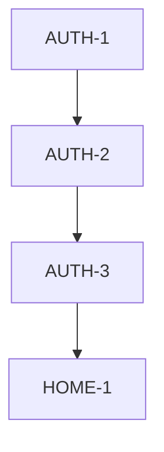

# Feature List & Status

모노레포 요약본은 `docs/feature_list.md`를 참고합니다.

## Legend
- ⬜ **Todo**: 작업 예정
- 🔄 **In Progress**: 작업 중
- 👀 **Need Verify**: 구현 완료, 검증 필요
- ✅ **Complete**: 완료 및 검증 끝

## Features

### 🔹 AUTH (Authentication)
사용자 인증 및 권한 관리

| ID | 상세 기능 | 상태 | 우선순위 | 스펙 |
|----|----------------|--------|----------|------|
| **AUTH-1** | 로그인 페이지 UI (Kakao, Google, Apple) | 👀 | P1 | [스펙](spec_login.md) |
| **AUTH-2** | 소셜 로그인 로직 연동 (Kakao, Google OIDC) | 👀 | P1 | - |
| **AUTH-3** | 쿠키 기반 라우팅 + 유저 세션 동기화 (SSR/CSR 공유) | 👀 | P1 | - |

### 🔹 HOME (Main Feed)
메인 피드 및 추천

| ID | 상세 기능 | 상태 | 우선순위 | 스펙 |
|----|----------------|--------|----------|------|
| **HOME-1** | 홈 상단 헤더/날씨/코디 이미지 UI | 👀 | P1 | - |
| **HOME-3** | 위치/날씨 API 연동 및 팁 문구 표시 | 👀 | P1 | - |

### 🔹 CLOSET (Closet)
옷장 목록 및 상세

| ID | 상세 기능 | 상태 | 우선순위 | 스펙 |
|----|----------------|--------|----------|------|
| **CLOSET-1** | 카테고리별 옷 이미지 목록 UI | 👀 | P1 | - |
| **CLOSET-2** | 옷 추가 (+버튼, 카메라/파일 선택) | 🔄 | P1 | - |
| **CLOSET-3** | 옷 상세 화면(메타정보/메모/공유) | 👀 | P1 | - |
| **CLOSET-4** | 즐겨찾기(하트) 표시/토글 | 🔄 | P2 | - |

### 🔹 LOOK (Look)
룩 목록 및 상세/등록

| ID | 상세 기능 | 상태 | 우선순위 | 스펙 |
|----|----------------|--------|----------|------|
| **LOOK-1** | 룩 카드 목록 UI | 👀 | P1 | - |
| **LOOK-2** | 룩 상세(2열 이미지 목록) | 👀 | P1 | - |
| **LOOK-3** | 룩 등록(이름/태그/옷 선택) | 👀 | P1 | - |
| **LOOK-4** | 룩 수정/삭제/공유/즐겨찾기 | ⬜ | P2 | - |

### 🔹 MY (My)
마이페이지

| ID | 상세 기능 | 상태 | 우선순위 | 스펙 |
|----|----------------|--------|----------|------|
| **MY-1** | 프로필(닉네임/이메일) + 통계 카드 | 👀 | P1 | - |
| **MY-2** | 등급 진행률 표시 | 👀 | P2 | - |
| **MY-3** | 설정(온도/언어/알림) | 👀 | P2 | - |
| **MY-4** | 고객지원(도움말/문의) + 로그아웃 | 🔄 | P2 | - |

## Work Dependency Graph
작업 순서 및 의존성 파악용

